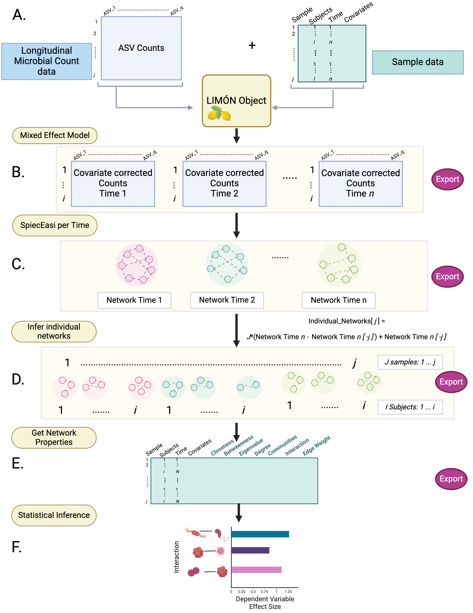

<!-- README.md is generated from README.Rmd. Please edit that file -->

<!-- README.md is generated from README.Rmd. Please edit that file -->

# LIMON

<!-- badges: start -->

<!-- badges: end -->

This pipeline is still under development. We appreciate any comments or
feedback to help improve this platform

## Motivation

------------------------------------------------------------------------

Microbial communities are dynamic structures that continually adapt to
their surrounding environment. Such communities play pivotal roles in
countless ecosystems from environmental to human health. Perturbations
of these community structures have been affiliated with many disease
processes such as Chron’s disease and cancer. Disturbances to existing
ecosystems often occur over time making it essential to have robust
methods for detecting longitudinal microbial interaction alterations as
they develop. Existing methods for identifying temporal microbial
communities’ alterations has focused on abundance changes in individual
taxa, leaving a crucial gap of how microbial interactions change
overtime. Doing so would require novel statistical approaches to handle
the complicated nature of compositional repeated count data. To address
these shortcomings, we have developed a pipeline, LIMON – Longitudinal
Individual Microbial Omics Networks. This novel statistical approach
addresses six key challenges of modeling temporal and microbial data;
(1) overdispersion, (2) zero-inflated count data, (3) compositionality,
(4) sample covariates over time, (5) repeated measuring errors, and (6)
uniquely accounting for individual network characteristics by a selected
feature of interest. In this model, temporal OTU count data is fitted to
a zero-inflated negative binomial linear mixed model, undergoes
centered-log ratio transformation and network inference with SPIEC-EASI,
and finally estimation of individual network properties longitudinally
using Linear Interpolation to Obtain Network Estimates for Single
Samples (LIONESS). This approach allows users to remove the random
effects of repeated samples and sample covariates, return networks per
time point, identify interaction changes between each time point, and
finally return individual networks and network characteristics per
sample/time point. In doing so, LIMON provides a platform to identify the
relationship between network centralities and sample features of
interest overtime. This tutorial covers how to run LIMON utilizing a
longitudinal infant microbiome study

## Work Flow

------------------------------------------------------------------------



## Installation

------------------------------------------------------------------------

You can install LIMON using devtools:

``` r
install.packages("devtools")
library(devtools)

install_github("LabBea/LIMON")
```

## Tutorial

------------------------------------------------------------------------

### 1. Load Library

``` r
library(tidyverse)
library(igraph)
library(NBZIMM)
library(lme4)
library(SpiecEasi)
library(LIMON)
library(ggeffects)
library(car)
library(phyloseq)
library(metagMisc)
```

### 2. Prepare the data

**Data Set up & Background**

The data you will need for the LIMON pipeline is a microbial count table
(taxa, genes etc.) and a sample data/metadata table. In this metadata
table, you should have a column for subjects (or whatever your repeated
measures are nested in), a column of discrete time points (1,2,3,4
etc.), and an outcome of interest (continuous, binary, or multilevel).
In this script, we will be running the full LIMON pipeline on an infant
dataset published in 2019. The data were pulled from this summarized
article <https://www.nature.com/articles/s41522-022-00345-5/figures/1>,
specifically reference the study; He, Xuan, et al. “Fecal microbiome and
metabolome of infants fed bovine MFGM supplemented formula or standard
formula with breast-fed infants as reference: a randomized controlled
trial.” Scientific reports 9.1 (2019): 1-14. In these data, infant ID
was used as the repeated measure, age as the time point (2,4,6, and 12
months) and diet type (Standard formula, Experimental Formula, Breast
Milk) as the multilevel outcome of interest.

**Metadata**  
Load the Metadata

``` r
data("He_2019_metadata")
```

Filter the data to infants with all four visits & create a binary column
for potential categorical covariates

``` r
metadata <- He_2019_metadata %>% 
  dplyr::select(Subject, X, Study.Group, Age, Gender, diet) %>%
  group_by(Subject) %>%
  # Filter to those with at least three visits
  filter(n() >= 4) %>%
  ungroup() %>%
  column_to_rownames("X") %>%
  # add a binary column for Gender
  mutate(Gender_binary = case_when(
    Gender == "Male" ~ 1,
    Gender == "Female" ~ 0)) %>%
  # add a binary column for Diet (Formula or Breastmilk)
  mutate(Diet_binary = case_when(diet == "Standard infant formula" ~ 0,
                                 diet == "Experimental infant formula" ~ 0,
                                 diet == "Breast milk" ~ 1))
```

**Count Data**  
Load the microbial count data (top 75 taxa from He et al). For LIMON we
recommend using 50 - 100 taxa. More taxa will take longer for the
individualized networks to run.

``` r
# Microbial Counts
############################################################
data("He_2019_data")

# Mutate column names to keep only the string after the last ";"
colnames(He_2019_data) <- colnames(He_2019_data) %>% 
  str_extract("([^;]+)$")
colnames(He_2019_data) <- make.names(colnames(He_2019_data), unique = TRUE)
He_2019_data <- He_2019_data %>% column_to_rownames("X")

# Ensure no columns sum to 0
raw_counts <- He_2019_data %>%
  dplyr::select(where(~ sum(.) > 0))
```

``` r
# Look at the data
hist(as.matrix(raw_counts), breaks = 100)
```


Check Mean and standard deviation of the data

``` r
# Stats
median(as.matrix(raw_counts))
#> [1] 0
mean(as.matrix(raw_counts))
#> [1] 136.861
sd(as.matrix(raw_counts))
#> [1] 676.3834

# Zeros
percent_zeros <- sum(raw_counts== 0) / (nrow(raw_counts) * ncol(raw_counts)) * 100
percent_zeros
#> [1] 75.48077
```

We can see the standard deviation of the counts is much higher than the
mean, and has a high percentage of 0’s. For the LIMON distribution fit,
we will use a zero-inflated negative binomial model. But first, lets CSS
normalize the data

To CSS normalize the counts, we used the functions in phyloseq

``` r
# Create the OTU table 
otu_table <- otu_table(raw_counts, taxa_are_rows = FALSE)
sample_data <- sample_data(metadata)

# CSS norm in Phyloseq
physeq <- phyloseq::phyloseq(otu_table, sample_data)
ps.css <- metagMisc::phyloseq_transform_css(physeq, norm= TRUE, log = TRUE)
#> Loading required namespace: metagenomeSeq

normalized_counts <- round(as.data.frame(t(ps.css@otu_table)))
```

**Check Covariate Data**  
Now we can plot out the average abundance of each genus by infant gender

``` r
#  Merge metadata with count table
common_samples <- intersect(rownames(normalized_counts), rownames(metadata))
normalized_counts <- normalized_counts[common_samples, ]
metadata <- metadata[common_samples, ]

# Merge
counts_meta <- merge(metadata, as.matrix(normalized_counts), by = 0, all=TRUE)
counts_meta <- counts_meta %>% column_to_rownames("Row.names")


# Examine mean Abundance by infant gender
mean_data <- counts_meta %>%
  group_by(Gender = counts_meta[[4]]) %>%
  summarise(across(8:81, mean, na.rm = TRUE)) %>%
  pivot_longer(-Gender, names_to = "Variable", values_to = "Mean")

# Plot the mean values by gender
ggplot(mean_data, aes(x = Variable, y = Mean, fill = as.factor(Gender))) +
  geom_bar(stat = "identity", position = "dodge") +
  scale_fill_manual(values = c("darkviolet","darkgreen")) +
  labs(x = "Genus", y = "Mean Abundance Count", title = "Mean Counts by Gender") +
  theme(axis.text.x = element_text(angle = 90, vjust = 0.5, hjust = 1))
```


### 3. Run LIMON

#### Step 1 - Create the LIMON object

``` r
# Ensure sample counts and metadata are in the same order
common_samples <- intersect(rownames(normalized_counts), rownames(metadata))
normalized_counts <- normalized_counts[common_samples, ]
metadata <- metadata[common_samples, ]


# Make LIMON object
L_obj <- LIMON_Obj(Counts = as.matrix(normalized_counts), 
                           SampleData = metadata)
```

Optionally, use the phyloseq_to_LIMON_Obj() to create the LIMON object
from an existing phyloseq object.

#### Step 2 - Correcting by covariates

Now we fit a zero-inflated negative binomial mixed-effects model to
account for the effect of infant sex. If multiple covariates are
included, specify them as ‘Cov1 + Cov2 + Cov3…’. Currently, LIMON
supports only continuous or binary covariates. For categorical variables
with multiple levels, use one-hot encoding to create separate columns
for each level.

Distribution options include a linear mixed effect model, zero-inflated
gaussian, negative binomial, and zero-inflated negative binomial.

``` r
# Set seed
set.seed(12345)
# Fit the distribution/remove covariates
#########################################
L_obj2 <- LIMON_DistrFit(Obj = L_obj, 
                           Time = "Age", 
                           Subject = "Subject", 
                           Covariates = c("Gender_binary"),
                           model = "Gender_binary",
                           distribution = "GLMM.Z")
```

#### Step 3 - Networks per timepoint

Next, estimate networks per time point.

``` r
set.seed(12345)
# SPIEC-EASI per time
# Set seed
pseed <- list(rep.num=50, seed=10010)


#infer network
L_obj3 <- LIMON_NetInf_Time(Obj = L_obj2, 
                                         method = "glasso", 
                                         sel.criterion = "bstars",
                                         lambda.min.ratio = 0.01,
                                         pulsar.select=TRUE, 
                                         pulsar.params=pseed,
                                         nlambda = 200)


# Print Networks
L_obj4 <- LIMON_Edges_Networks(L_obj3, threshold = 0.02, vertex.size = 3, 
                                       vertex.label.cex = 8, vertex.label.color = "black")
```


#### Step 4 - Individualized Networks

Run the individualized networks step, note this might take a bit. 

``` r
# Set seed
set.seed(12345)
pseed <- list(rep.num=50, seed=10010)


# individual Networks
L_obj6 <- LIMON_IndNet(Obj = L_obj4, method = "glasso", 
                                         sel.criterion = "bstars",
                                         lambda.min.ratio = 0.01,
                                         pulsar.params=pseed,
                                         nlambda = 200)
```
 
Optionally, save the object using saveRDS and read it back in later

``` r
# Save the object
#saveRDS(L_obj6, here("Output","HE_LIMON.rds"))
#L_obj6 <- readRDS(here("Output","HE_LIMON.rds"))
```

#### Step 5 - Get the edges and centralities

``` r
# Extract edges and centralities
L_obj7<- LIMON_IndEdges(L_obj6, threshold = 0.02)
L_obj8 <- LIMON_Centralities(L_obj7, threshold = 0.02)
```

#### Step 6 - Statistical inference

LIMON will run a statistical model with per each unique interaction at
each time point with that interactions edge weight as the predictor, and
a user specified dependent variable as the outcome. The current model
options are “lm” for a linear regression (for a continuous outcome
variable), “logit” for a logistic regression (for a binary outcome
variable only), and “multinom”, multinomial model (for 3 or more
categories). There is a minimum number of observations required for the
different models to run; 10 for lm, 20 for logit, and 30 for multinom.
If there are not enough observations for that interaction at that time
point, a message will be returned to the user.

The defualt is to not filter the models by significance. Users can set a
p-value or adjusted p-value threshold to limit the number of models
returned. This is also useful for printing the graphs from the linear
and logistic models. Users can specify if they want to print a graph of
all of their interactions returned from the model (plot_nodes = TRUE).
This will not work for the multinomial model however, we will address
how to visualize those data in a bit.

Our question of interest in this data set is how do the different diets
(standard formula; SF, experimental formula; EF, and breast milk; BF)
alter microbial interactions across the first year of life (2,4,6,12
months). Lets first start by looking at the binary diet outcome we
created, which was formula fed (SF or EF; 0) vs Breast Fed (1). Run a
logisitc model and print the graphs with a p-value threshold of 0.05

**Logistic Model**

``` r
# Create a new object
L_obj9 <- L_obj8


L_obj9 <- LIMON_StatNodes(L_obj9, dependent = "Diet_binary", time = "Age", pval = 0.05,
                           method ="logit", timepoints= NULL, plot_nodes = TRUE, 
                           estimate = NULL, custom_colors = NULL, point_size = 5)
```


**Multinomial Model** Now lets take a look at differences across the
three diets using a multinomial model.

``` r
# Create a new object
L_obj9 <- L_obj8


L_obj9 <- LIMON_StatNodes(L_obj9, dependent = "diet", time = "Age", pval = 0.05,
                           method ="multinom", timepoints= NULL, plot_nodes = FALSE, 
                           estimate = NULL, custom_colors = NULL, point_size = 8)
```

Looking at  the Significant_Interactions shows us the most significant edge
is between g_Parabacteroides and g_Actinomyces at 6 months. Lets dive a
bit deeper into how to interpret this finding.

**Parabacteroides and Actinomyces at 6 months**  
First, lets pull out that exact interaction at time 6 and re run the
multinomial model

``` r
Edge_Table <- L_obj8[["Merged_Edge_Table"]]

# Filter data to a timepoint of interest        
edge_data_time_full <- Edge_Table %>% filter(Edge_Table[["Age"]] == 6)

# Filter to an interaction of interest
edge_data_time <- edge_data_time_full %>% filter(Interaction == "g__Parabacteroides-g__Actinomyces")
dependent <- "diet"

# Run the model
formula <- as.formula(paste(dependent, "~Edge_weight"))
set.seed(12345)
model <- nnet::multinom(formula, data = edge_data_time, trace = FALSE)
model_summary <- broom::tidy(model, conf.int = TRUE)
model_summary$Interaction <- "g__Parabacteroides-g__Actinomyces"
model_summary$Time_Level <- 6
model_summary$Model_Type <- "Multinomial"
model_summary$Model_SampleSize <- stats::nobs(model)
```

Now we have a table similar to what is output by LIMON, but we can get a
bit more information about the model. Using the predict function from
the stats package, we can get a list of probabilities of each diet type
for an edge_weight between g\_\_ Parabacteroides & g_Actinomyces of 2.5

``` r
# get probabilities
set.seed(12345)
predict(model, newdata = data.frame(Edge_weight = 2.5), type = 'probs')
#>                 Breast milk Experimental infant formula 
#>                   0.0454197                   0.2909928 
#>     Standard infant formula 
#>                   0.6635875
```

This tells us a positive edge weight in the network between these two
taxa indicates the infant is more like to be on SF diet, with a lower
probability of the EF diet, and a much lower change of being BF at 6
months.

We can take this a step further using ggeffect() to extend the edge
weight possible values and plot the probabilities and confidence
intervals by diet type.

``` r
set.seed(12345)
prob_effects <- ggeffect(model, terms = "Edge_weight[-2:2,by=0.5]")

# Graph probabilities
ggplot(prob_effects) +
  aes(x = x, y = predicted, fill = response.level, color = response.level) +
  geom_line() +
  geom_ribbon(aes(ymin = conf.low, ymax = conf.high), alpha = 1/2) +
  labs(x = 'g__Parabacteroides-g__Actinomyces Edge Weight', y = 'Predicted Probability') +
  ylim(c(0, 1)) +
  theme_classic() +
  scale_color_manual(
    values = c("#bc80bd", "#ffed6f", "#ccebc5"), 
    name = "Infant Diet",
    labels = c("Breast Milk" = "Breast.milk", 
               "Experimental infant formula" = "Experimental.infant.formula", 
               "Standard infant formula" = "Standard.infant.formula") ) +
  scale_fill_manual(
    values = c("#bc80bd", "#ffed6f", "#ccebc5"), 
    name = "Infant Diet",
    labels = c("Breast Milk" = "Breast.milk", 
               "Experimental infant formula" = "Experimental.infant.formula", 
               "Standard infant formula" = "Standard.infant.formula") ) +
  theme(
    axis.text.x = element_text(color = "black", family = "Arial", size = 11), 
    axis.text.y = element_text(color = "black", family = "Arial", size = 11))
```


Finally, check to see if having the edge weight between
g\_\_Parabacteroides-g\_\_Actinomyces helps predict the diet type better
than an intercept only model

``` r
# Check model 
set.seed(12345)
car::Anova(model)
#> # weights:  6 (2 variable)
#> initial  value 57.127839 
#> final  value 53.658640 
#> converged
#> Analysis of Deviance Table (Type II tests)
#> 
#> Response: diet
#>             LR Chisq Df Pr(>Chisq)  
#> Edge_weight   7.6383  2    0.02195 *
#> ---
#> Signif. codes:  0 '***' 0.001 '**' 0.01 '*' 0.05 '.' 0.1 ' ' 1
```

From this likelihood ratio test, we see it does in fact provide a better
prediction of 6 month diet type.

The next question is wether or not this holds true at other timepoints?
We tested the model for 2 and 4 months, but neither had enough
observations (minimum of 30 for this interaction) for the multinomial
model to run. There were enough at 12 months.

**Parabacteroides and Actinomyces at 12 months**  
Running the same code as before

``` r
# Filter data to a timepoint of interest        
edge_data_time_full <- Edge_Table %>% filter(Edge_Table[["Age"]] == 12)

# Filter to an interaction of interest
edge_data_time <- edge_data_time_full %>% filter(Interaction == "g__Parabacteroides-g__Actinomyces")
dependent <- "diet"

# Run the model
formula <- as.formula(paste(dependent, "~Edge_weight"))
set.seed(12345)
model <- nnet::multinom(formula, data = edge_data_time, trace = FALSE)
model_summary <- broom::tidy(model, conf.int = TRUE)
model_summary$Interaction <- "g__Parabacteroides-g__Actinomyces"
model_summary$Time_Level <- 12
model_summary$Model_Type <- "Multinomial"
model_summary$Model_SampleSize <- stats::nobs(model)
```

Check the diet probabilites

``` r
# get probabilities
set.seed(12345)
predict(model, newdata = data.frame(Edge_weight = 2.5), type = 'probs')
#>                 Breast milk Experimental infant formula 
#>                  0.06532248                  0.04707426 
#>     Standard infant formula 
#>                  0.88760326
```

We see a high probability, but is that signficant?

``` r
set.seed(12345)
prob_effects <- ggeffect(model, terms = "Edge_weight[-2:2,by=0.5]")
# Graph probabilities
ggplot(prob_effects) +
  aes(x = x, y = predicted, fill = response.level, color = response.level) +
  geom_line() +
  geom_ribbon(aes(ymin = conf.low, ymax = conf.high), alpha = 1/2) +
  labs(x = 'g__Parabacteroides-g__Actinomyces Edge Weight', y = 'Predicted Probability') +
  ylim(c(0, 1)) +
  theme_classic() +
  scale_color_manual(
    values = c("#bc80bd", "#ffed6f", "#ccebc5"), 
    name = "Infant Diet",
    labels = c("Breast Milk" = "Breast.milk", 
               "Experimental infant formula" = "Experimental.infant.formula", 
               "Standard infant formula" = "Standard.infant.formula") ) +
  scale_fill_manual(
    values = c("#bc80bd", "#ffed6f", "#ccebc5"), 
    name = "Infant Diet",
    labels = c("Breast Milk" = "Breast.milk", 
               "Experimental infant formula" = "Experimental.infant.formula", 
               "Standard infant formula" = "Standard.infant.formula") ) +
  theme(
    axis.text.x = element_text(color = "black", family = "Arial", size = 11), 
    axis.text.y = element_text(color = "black", family = "Arial", size = 11))
```


From this graph we see the confidence intervals of edge weight by diet
type almost completely overlap at 12 months

Checking the model against a null (intercept only) model,

``` r
set.seed(12345)
car::Anova(model)
#> # weights:  6 (2 variable)
#> initial  value 52.733390 
#> final  value 49.152491 
#> converged
#> Analysis of Deviance Table (Type II tests)
#> 
#> Response: diet
#>             LR Chisq Df Pr(>Chisq)
#> Edge_weight   1.0058  2     0.6048
```

We indeed confirm adding in the edge weight between g_Parabacteroides
and g_Actinomyces does not provide a better fit than the null model at
12 months.


**Summary**
This is just a brief introduction to the inferences LIMON can provide.
Other data that is stored in your final objects includes centrality
measures per sample (per subject per time point), all of the edge
weights per interaction per sample, and more. Remember, when life gives
you lemons, make microbial individualized networks. Happy investigating!
